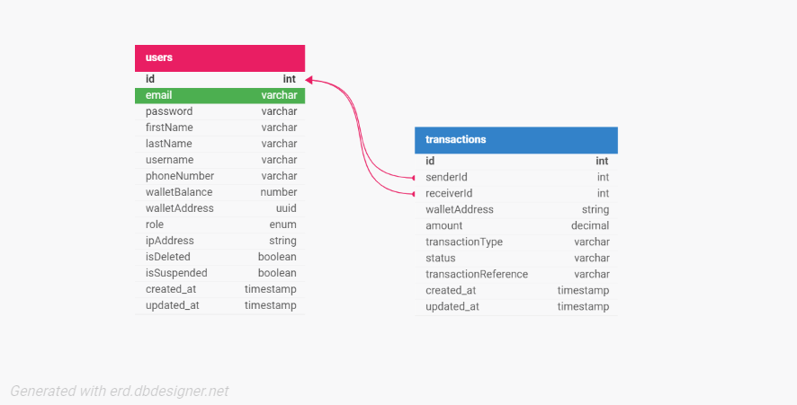

# Demo Credit 💳

Demo Credit is a wallet management application that allows users to easily register, manage their wallets, and perform various financial transactions, including funding, withdrawing, and transferring money to other users.

## Features

- **User Registration and Authentication**: Secure registration and login process.

- **Wallet Management**: Users can fund, withdraw, and transfer funds securely programmatically.

- **User-to-User Transfers**: Send money to other users within the system using wallet addresses.

## Database Schema

### ER Diagram

The database structure is defined using two main tables: users and transactions.

- **Users Table**: Stores user information like email, username, password, and wallet details.

- **Transactions Table**: Tracks all transactions performed by users, including wallet transfers, deposits, and withdrawals.

Here’s a visual representation of the schema:


## Technologies Used

The Project technologies used:

- [x] Nodejs
- [x] Typescript
- [x] MySQL
- [x] Knexjs ORM

## API Endpoints

### User Endpoints

1. **Register a User**

- **Endpoint**: `{{BASE_URL}}/api/v1/auth/sign-up`
- **Method**: `POST`
- **Description**: Create a new account.
- **Request Body**:

```json
{
	"email": "string",
	"password": "string",
	"firstName": "string",
	"lastName": "string",
	"username": "string",
	"phoneNumber": "string"
}
```

- **Response**:

```json
{
	"status": "success",
	"data": "number",
	"message": "User created successfully"
}
```

2. **Login**

- **Endpoint**: `{{BASE_URL}}/api/v1/auth/sign-in`
- **Method**: `POST`
- **Description**: Login to your account.
- **Request Body**:

```json
{
	"email": "string",
	"password": "string"
}
```

- **Response**:

```json
{
	"status": "success",
	"data": {
		"id": "number",
		"firstName": "string",
		"lastName": "string",
		"username": "string",
		"phoneNumber": "string",
		"email": "string",
		"walletBalance": "number",
		"walletAddress": "string",
		"role": "string",
		"ipAddress": "string",
		"isDeleted": "boolean",
		"isSuspended": "boolean",
		"created_at": "Date",
		"updated_at": "Date"
	},
	"message": "Login successful"
}
```

### Wallet Endpoints

1. **Fund Wallet**

- **Endpoint**: `{{BASE_URL}}/api/v1/user/wallet/fund`
- **Method**: `POST`
- **Description**: Fund your wallet.
- **Headers**:

```json
{
	"Authorization": "Bearer <your_token_here>"
}
```

- **Request Body**:

```json
{
	"amount": "number"
}
```

- **Response**:

```json
{
	"status": "success",
	"data": {
		"walletBalance": "number"
	},
	"message": "Wallet funded successfully"
}
```

2. **Withdraw Funds**

- **Endpoint**: `{{BASE_URL}}/api/v1/user/withdraw`
- **Method**: `POST`
- **Description**: Withdraw funds from your wallet.
- **Headers**:

```json
{
	"Authorization": "Bearer <your_token_here>"
}
```

- **Request Body**:

```json
{
	"amount": "number"
}
```

- **Response**:

```json
{
	"status": "success",
	"data": {
		"walletBalance": "number"
	},
	"message": "Withdrawal successful"
}
```

3. **Wallet to wallet transfer **

- **Endpoint**: `{{BASE_URL}}/api/v1/user/transfer/fund`
- **Method**: `POST`
- **Description**: Transfer money to another user's wallet using their wallet address.
- **Headers**:

```json
{
	"Authorization": "Bearer <your_token_here>"
}
```

- **Request Body**:

```json
{
	"walletAddress": "string",
	"amount": "number"
}
```

- **Response**:

```json
{
	"status": "success",
	"data": {
		"walletBalance": "number"
	},
	"message": "Transfer successful"
}
```

## Getting Started

### Installation

To install Demo Credit locally:

1. Clone the repository:

```bash
   git clone https://github.com/Davheed2/lendSqr.git
```

2. Change to the project directory:

```bash
   cd lendSqr
```

3. Install dependencies

```bash
   npm install
```

4. Set up environment variables by copying `.env.example` to `.env` and filling in your credentials.

### Running the Project

To start the server:

```bash
   npm run dev
```

You should be able to access the API at `http://localhost:your-port`.

## License

By contributing to Demo Credit, you agree that your contributions will be licensed under the [MIT License](LICENSE.md).

---
